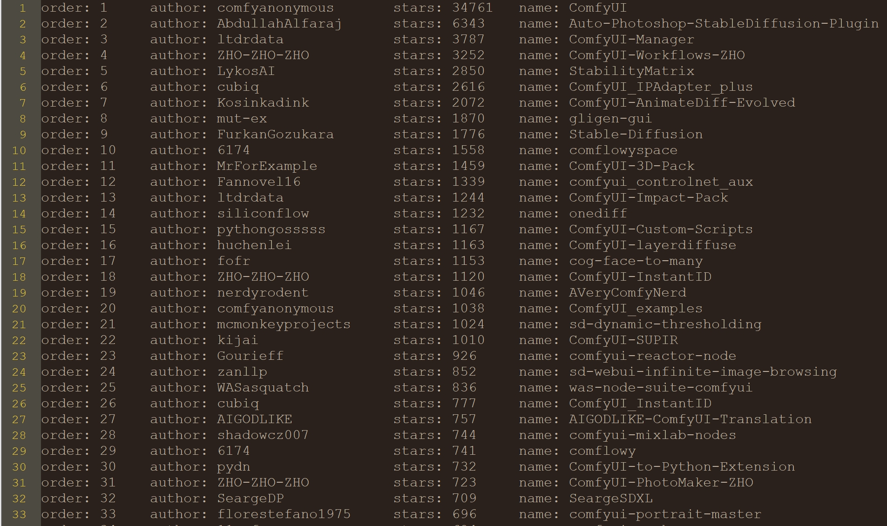

## 项目介绍 | Info

- 用于收集ComfyUI自定义插件，按stars数从大到小排列,只是统计排名，作者，项目名称以及连接

- config.json中需要配置github的Tokens
- Tokens获取方法：settings-->Developer Settings-->Tokens

## 关于我|About Me

📬 **联系我**：
- 邮箱：wyply115@163.com
- ComfySpace：https://t.zsxq.com/19H0cfM1O
